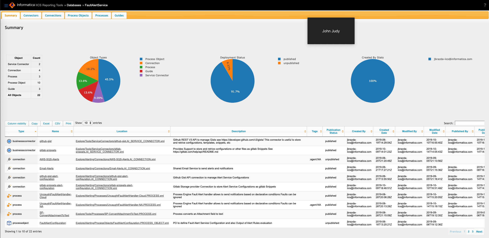

# IICS Design Reporting Tools

This project contains set of tools to provide reporting on exported assets packages from Informatica IICS
Tool  is Installed and deployed by Apache Ant Script and set of XQuery modules based web application deployed on BaseX Database HTTP Server



See [Other Screenshots](doc/screenshots.md)

<!-- TOC -->

- [IICS Design Reporting Tools](#iics-design-reporting-tools)
  - [Features](#features)
  - [Installation of the Tool](#installation-of-the-tool)
    - [Pre-requisites](#pre-requisites)
  - [Install Steps](#install-steps)
  - [Upgrading from previous Version](#upgrading-from-previous-version)
  - [Create Exported Objects Database](#create-exported-objects-database)
  - [Ant Script main Properties File](#ant-script-main-properties-file)
  - [Target basex.create.db](#target-basexcreatedb)
  - [Parameters](#parameters)
  - [Example Use in Ant Script](#example-use-in-ant-script)
  - [Target basex.create.db](#target-basexcreatedb-1)
  - [Parameters](#parameters-1)
  - [Example Use in Ant Script](#example-use-in-ant-script-1)
  - [Release Notes](#release-notes)
    - [Release Feb 2022](#release-feb-2022)
    - [Release 2019-12-0](#release-2019-12-0)

<!-- /TOC -->

## Features

- Detailed IICS exported asset reports
- Basic designs statistics
- Dependency and Impact analysis
- Detailed Design report
- Supported IICS object types
    - Service Connectors
    - Connection
    - Process Objects
    - Processes
    - Guides
    - Task Flows
- Support for MacOS, Windows, Linux

This tool is developed as web application on top of BaseX XQuery Database and HTTP Server provided by BaseX
Tool provides set of scripts to download, install and deploy custom application to BaseX Server.

It can be plugged-in into the automated Build process to Publish And  make online reports available as shown in the
[Fault Alert Service Implementation](https://github.com/jbrazda/icai-fault-alert-service)

## Installation of the Tool

### Pre-requisites

- JAVA JRE 1.8 or newer
- Apache Ant 1.9 or newer

> Note: By default BaseX runtime would be installed in the `/opt/java/library/basex` folder on Mac or Linux you have to create java folder and grant permissions to it as follows. You can set location to a different folder if desired in step 2 of the installation guide

```shell
mkdir /opt/java
# set owner to your user and group
chown jbrazda:jbrazda /opt/java
```

> Note you can follow My guide to setup these [here](https://github.com/jbrazda/Informatica/blob/master/Guides/InformaticaCloud/set_development_environment.md)

## Install Steps

1. Clone this repository
2. Run ant target
  
    ```shell
    ant basex.configure
    ```

3. Run ant target ``
  
    ```shell
    ant basex.install
    ```

4. Run ant target
  
    ```shell
    ant basex.deploy.webapps
    ```

5. Run ant target
  
    ```shell
    ant basexhttp.start
    ```

6. Create Database from IICS Exported Package Zip file
7. Go tp Go to [http://localhost:8984/iics](http://localhost:8984/iics)

## Upgrading from previous Version

1. Update Repository From github
  
    ```shell
    git pull --rebase
    ```

2. run ant `ant basex.upgrade`

## Create Exported Objects Database

You can import unmodified  Export package to BaseX Databases  several ways

Using a command line as shown below or using BaseX Gui Application.

```shell
basex -c "CREATE DATABASE [DB_NAME] [PATH TO EXPORTED zip]"
```

Example

```shell
basex -c "CREATE DATABASE IICS_ICLAB_SRC_2019_07_08 /Users/jbrazda/git/icrt_common/com.informatica.ipd/target/drop/IICS_ICLAB_SRC_2019_07_08.zip"
```

Ant Target Parameters and Examples

```text
Buildfile: /home/jbrazda/git/github/jbrazda/iics-reporting-tools/build.xml

            IICS Reporting Tools Build Script

Main targets:

 basex.configure            Configure Reporting Tool
 basex.create.db            Create new BaseX Database from Source file, archive or directory
 basex.deploy.webapps       Deploys Custom Webapps to BaseX Http Server to basex_home/webapp
 basex.download             Download BaseX
 basex.download.update      Download BaseX Update
 basex.drop.db              Drop Existing BaseX DB by name
 basex.gui                  Start BaseX GUI
 basex.install              Installs BaseX DB and Tools
 basex.sample.db.create     Create Sample DEMO_DB
 basex.sample.db.drop       Drop Sample DEMO_DB
 basex.uninstall            Stops and Uninstall BaseX Server and Tools
 basex.upgrade              Upgrades BaseX Runtime to Latest Version
 basexhttp.start            Run BaseX HTTP Server
 basexhttp.stop             Stop BaseX HTTP Server
 help                       help - describes how to use this script
 install.all                Installs BaseX Tools, Deploys IICS Reporting App and runs BaseX HTTP server
 project.update.from.basex  Updates sources from basex http server webapp/iics dir
```

## Ant Script main Properties File

```properties
# Tool Defaults
default.iics.reporting.basex.home=/opt/java/library/basex
default.iics.reporting.downloads.dir=${user.home}/Downloads
iics.reporting.config=${user.home}/.iics.reporting.properties
iics.reporting.sample.file=FaultAlertService_InitialInstall_All_Designs.zip
iics.reporting.sample.url=https://raw.githubusercontent.com/jbrazda/icai-fault-alert-service/master/dist/FaultAlertService_InitialInstall_All_Designs.zip


# BaseX Distribution Properties
basex.download.file=BaseX924.zip
basex.download.url=http://files.basex.org/releases/9.2.4/${basex.download.file}
basex.http.base_url=http://localhost:8984

basex.java_home=/Library/Java/JavaVirtualMachines/jdk1.8.0_162.jdk/Contents/Home

## Configure your IICS org region. For example, us, eu, ap
iics.region=us
```

## Target basex.create.db

This target Will create New database Typically from zip archive as a part of the build process

## Parameters

| Property               | Description                                                                                                                         | Example Value                               |
|------------------------|-------------------------------------------------------------------------------------------------------------------------------------|---------------------------------------------|
| basex.create.db.name   | Database name                                                                                                                       | FaultAlertService_iclab-dev_all_designs     |
| basex.create.db.source | Database source Can be Directory containing XML files, single XML File or zip archive which is the most common scenario in our case | FaultAlertService_iclab-dev_all_designs.zip |
| env.info.displayed     | Suppress print of environment Info                                                                                                  | true                                        |

## Example Use in Ant Script

You can run the tools from a parent Ant script using an `ant` target Assuming that the `${tools.package.reporting}` is pointing to `build.xml` file of this project

```xml
<ant antfile="${tools.package.reporting}" target="basex.create.db" inheritall="false" inheritrefs="false">
    <property name="basex.create.db.name" value="${release.package.label}"/>
    <property name="basex.create.db.source" location="${iics.import.dir}/${release.package.label}.zip"/>
    <property name="env.info.displayed" value="true"/>
</ant>
```

## Target basex.create.db

This target Will create New database Typically from zip archive as a part of the build process

## Parameters

| Property           | Description                        | Example Value                           |
|--------------------|------------------------------------|-----------------------------------------|
| basex.drop.db.name | Database name                      | FaultAlertService_iclab-dev_all_designs |
| env.info.displayed | Suppress print of environment Info | true                                    |

## Example Use in Ant Script

```xml
<ant antfile="${tools.package.reporting}" target="basex.drop.db" inheritall="false" inheritrefs="false">
    <property name="basex.drop.db.name" value="DB_NAME"/>
    <property name="env.info.displayed" value="true"/>
</ant>
```

## Release Notes

### Release Feb 2022

This version brings range of changes toi installation and maintenance of the reporting tool

- upgraded BaseX Runtime to Version 9.6
- Refactored build.xml to Install and manage
- Added new ant targets to Self update and automated upgrade of the basex to latest available version
- some previous target names have changed see current targets

```text
Buildfile: build.xml

            IICS Reporting Tools Build Script

Main targets:

 basex.configure            Configure Reporting Tool
 basex.create.db            Create new BaseX Database from Source file, archive or directory
 basex.deploy.webapps       Deploys Custom Webapps to BaseX Http Server to basex_home/webapp
 basex.download             Download BaseX
 basex.download.update      Download BaseX Update
 basex.drop.db              Drop Existing BaseX DB by name
 basex.gui                  Start BaseX GUI
 basex.install              Installs BaseX DB and Tools
 basex.sample.db.create     Create Sample DEMO_DB
 basex.sample.db.drop       Drop Sample DEMO_DB
 basex.uninstall            Stops and Uninstall BaseX Server and Tools
 basex.upgrade              Upgrades BaseX Runtime to Latest Version
 basexhttp.start            Run BaseX HTTP Server
 basexhttp.stop             Stop BaseX HTTP Server
 help                       help - describes how to use this script
 install.all                Installs BaseX Tools, Deploys IICS Reporting App and runs BaseX HTTP server
 project.update.from.basex  Updates sources from basex http server webapp/iics dir
```

### Release 2019-12-0

- Upgraded BaseX Runtime to Version 9.3

To update your BaseX Installation Pull changes from this repository and run following Commands

> NOTE: This will completely remove previous installation including any previously imported Databases (If you want to preserve your existing databases, backup your basex_home/data before you proceed)

```shell
ant basex.stop
ant basex.uninstall
ant basex.install
ant basex.deploy.iics
ant basex.run
```
